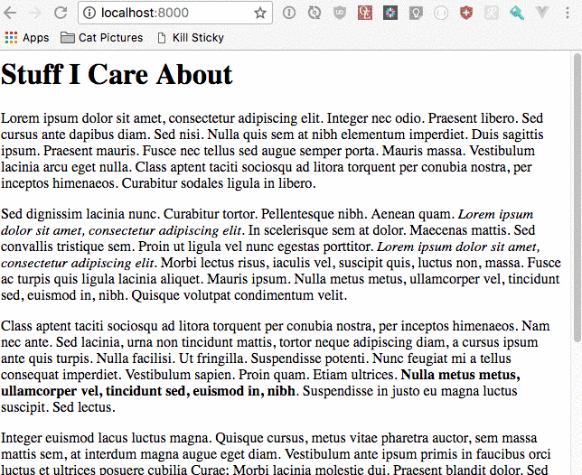
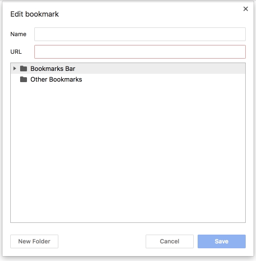

# kill-sticky

A bookmarklet to remove sticky elements and restore scrolling to web pages!



## Background

Alisdair McDiarmid wrote at his [Kill sticky headers](https://alisdair.mcdiarmid.org/kill-sticky-headers/) 
bookmarklet page...

> I hate sticky headers. I want to kill sticky headers.

I could not agree more.

But, while McDiarmid's code has already been immensely helpful to me, I wanted to extend it to also kill of another 
recent trend: marketing modals. They also abuse `position: fixed` styling and **remove your ability to scroll with
`overflow: hidden`**. Not cool, man.

And that's what this extension aims to address:
- Delete fixed [position](https://developer.mozilla.org/en-US/docs/Web/CSS/position) styled elements
- Change hidden [overflow](https://developer.mozilla.org/en-US/docs/Web/CSS/overflow) styles to `auto`

## Installation

Make a new bookmark (on your bookmark bar) with the following URL:

```
javascript:(function()%7Bdocument.querySelectorAll(%22body%20*%22).forEach(function(node)%7Bif(%5B%22fixed%22%2C%22sticky%22%5D.includes(getComputedStyle(node).position))%7Bnode.parentNode.removeChild(node)%7D%7D)%3Bvar%20htmlNode%3Ddocument.querySelector(%22html%22)%3BhtmlNode.style%5B%22overflow%22%5D%3D%22auto%22%3BhtmlNode.style%5B%22overflow-x%22%5D%3D%22auto%22%3BhtmlNode.style%5B%22overflow-y%22%5D%3D%22auto%22%7D)()%3B%0A
```



## Usage

Every time you see a bothersome fixed position element and/or loss of scrolling functionality, click the bookmark!

This may break the page sometimes, such as deleting nav or causing scrollbars to show up where they shouldn't. If 
that happens, just reload the page.


## How the bookmarklet works

1. Iterate through all child nodes of `body`. Delete the node if it is styled with `position: fixed`.
2. Set the style of the `html` node for `overflow: auto`.

```javascript
document.querySelectorAll('body *').forEach(function(node) {
if (getComputedStyle(node).position === 'fixed') {
node.parentNode.removeChild(node);
}
});

var htmlNode = document.querySelector('html');
htmlNode.style['overflow'] = 'auto';
htmlNode.style['overflow-x'] = 'auto';
htmlNode.style['overflow-y'] = 'auto';
```

## Building (Only if you want to contribute)

We're creating a bookmarklet, so our code needs to be minified and URL encoded. 

Run the following the project root directory:

```console
$ docker build . -t kill-sticky && docker run --rm -it -v $(pwd):/kill-sticky kill-sticky
```

This will
